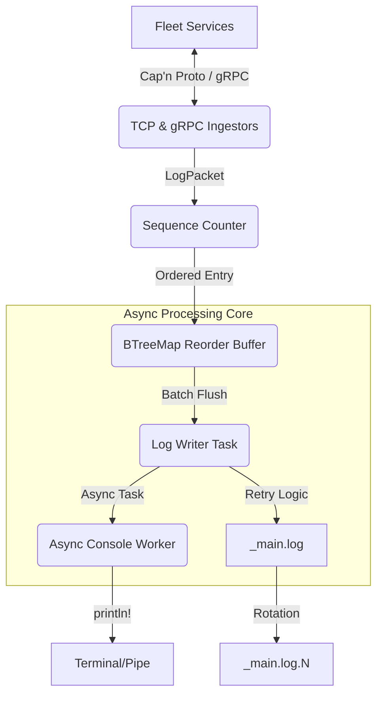

# Log Server Architecture

This document provides a technical deep-dive into the architecture of the `log-server`, a high-performance logging ingestor for the Bastien-Antigravity fleet.

## High-Level Overview

The Log Server is designed as a centralized, non-blocking log ingestion and ordering system. Its primary goals are:
- **Zero Backpressure**: Ingesting logs must not slow down the source microservices.
- **Strict Ordering**: Messages are persisted to disk in the exact sequence they were received.
- **Resource Integrity**: Prevents memory leaks and zombie connections through strict timeouts and buffer management.

## Component Architecture

### 1. Ingestion Layer
The server supports two concurrent protocols for log ingestion:
- **TCP (Cap'n Proto)**: High-performance binary ingestion using packed serialization and Big-Endian length framing.
- **gRPC (Tonic)**: Standardized gateway for environments requiring structured service-to-service communication.

**Key Hardening**: All TCP ingestors implement a 60-second `IdleTimeout` to automatically prune dead connections.

### 2. Networking (`SafeSocket`)
The low-level transport uses a custom wrapper around Tokio's `TcpStream`.
- **Memory Optimization**: Uses a reusable stack-based buffer for chunked reading to eliminate heap churn during high-volume ingestion.
- **Frame Validation**: Enforces a `MAX_MESSAGE_SIZE` (10MB) and Big-Endian length prefix validation to prevent OOM attacks.

### 3. Log Writer Task
The central orchestrator of the persistence layer.
- **Sequence Integrity**: Uses a `BTreeMap` to reorder out-of-order packets.
- **Gap Management**: If a sequence number is missing beyond the `gap_timeout_ms` (500ms), the writer inserts a synthetic `[SEQUENCE_GAP]` entry and continues.
- **Non-Blocking Console**: Offloads `println!` operations to a separate async task to prevent slow terminal output from blocking disk persistence or network ingestion.

### 4. Storage & Rotation
- **Atomic Writes**: Uses `AsyncWriteExt` with batch-retry logic to ensure log durability.
- **Rotation Strategy**: Automatically rotates files when they reach 10MB, maintaining a configurable count of backups.

## Data Flow

### Log Ingestion Flow
1. **Source** sends a framed message.
2. **Ingestor** reads length, validates, and deserializes the payload.
3. **Sequencer** assigns a global sequence number (`AtomicU64`).
4. **Buffer** stores the entry in a `BTreeMap`.
5. **LogWriter** waits for the next expected sequence number or a timeout.
6. **Persistence**: The entry is formatted and written to disk in a batch.
7. **Observation**: The entry is queued for the async console worker.

## Dependencies

- **Tokio**: Multi-threaded async runtime.
- **Cap'n Proto**: High-performance binary serialization.
- **Tonic**: Rust gRPC implementation.
- **Microservice-Toolbox**: Standardized address resolution and bootstrap.
- **Chrono**: High-precision UTC timestamping.
