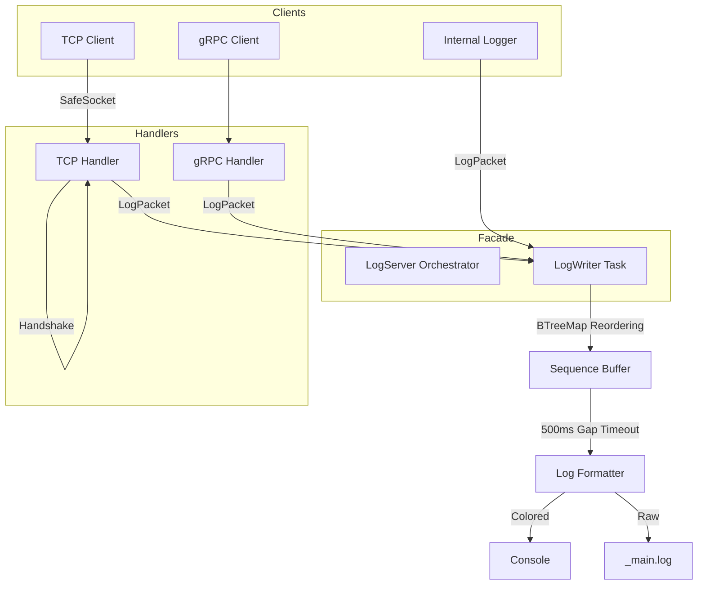

# Log Server Topology

## System Architecture

The Log Server uses a **Zero-String Ingestion Pipeline** to ensure high throughput and semantic integrity.

## Protocol Specifications
- **Transport**: SafeSocket (TCP) with Length-Prefixed Framing.
- **Serialization**: Cap'n Proto (TCP) / Protobuf (gRPC).
- **Identity**: Mandatory Handshake (TCP) required before data transmission.
- **Sequence Enforcement**: 500ms timeout for missing sequences to maintain service availability.
