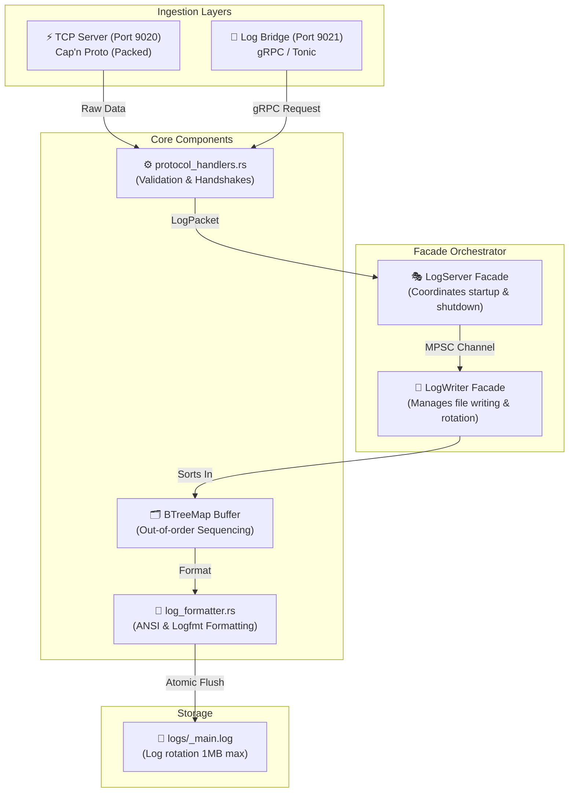

---
tags:
- '#ai/ignore'
- '#zone/3-fleet'
microservice: log-server
type: architecture-overview
status: active
---
# 🦀 Log Server: Architecture Overview

Welcome to the **Log Server Architecture Guide**. The `log-server` is a high-performance observability sink written in Rust (v1.88+) designed to ingest, sequence, and write logs from the entire Bastien-Antigravity fleet.

---

## 🏗️ 1. Core Structural Layout

The codebase utilizes a clean **Facade Pattern** to isolate high-throughput networking from underlying file writing and ordering mechanics:



*   **Ingestion Layers**: Safe, isolated network tasks running on Tokio green threads.
*   **Facade Layers**: High-level managers implementing safe resource management and simple bootstrap boundaries.
*   **Core Logic**: Functional, zero-allocation algorithms for data transformation and sequence correction.

---

## ⚡ 2. The Ingest Pipeline & Threading Mechanics

To ensure absolute chronological logging under heavy network jitter, the `log-server` decouples networking threads from disk I/O using a thread-safe **MPSC (Multi-Producer, Single-Consumer) queue**:

```
[TCP Client 1]  ---\
[TCP Client 2]  ------>  [ MPSC Queue (Capacity: 1024) ]  -->  [ LogWriter (Single Async Task) ]
[gRPC Client 3] ---/                                                  |
                                                                      v
                                                             [ BTreeMap Buffer ]
                                                                      |
                                                                      v
                                                             [ logs/_main.log ]
```

1.  **Network Handlers (Producers)**:
    *   Each raw TCP connection is allocated a separate Tokio task spawning a `SafeSocket` framer.
    *   It performs the **Mandatory Handshake (`HelloMsg`)**, validates packet size, deserializes the Cap'n Proto payload, and increments the thread-safe global `AtomicU64` sequence counter.
    *   It packages the log into a `LogPacket` and sends it down the `mpsc::Sender` channel.
2.  **LogWriter (Consumer)**:
    *   A single background worker `writer_task` owns the `mpsc::Receiver`.
    *   It processes incoming packets sequentially, inserting them into an in-memory `BTreeMap` sorted by sequence ID.
    *   It flushes logs in dynamic batches to disk once sequence numbers align, ensuring perfect chronological order in the physical file.

---

## 🛡️ 3. Safety Controls

*   **Slow-Loris Guard**: The TCP server enforces a strict **5-second timeout** on incoming handshakes. Non-compliant connections are instantly severed to prevent exhaustion.
*   **Dynamic Backpressure**: If the MPSC buffer hits 1024 messages (e.g., due to disk I/O bottlenecks), network producers yield asynchronously to preserve memory safety.
*   **Decoupled Failure Domains**: An ingestion crash on a single gRPC or TCP socket never halts the file writing engine or blocks other clients.
