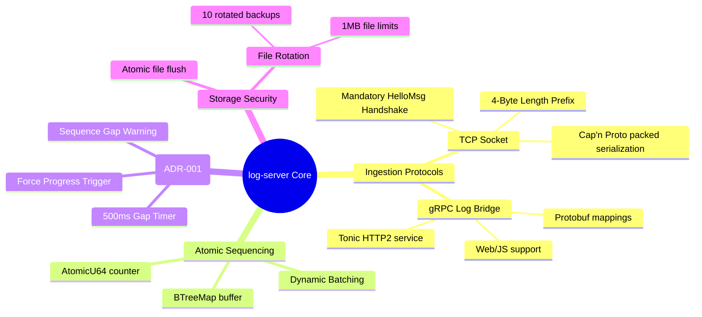

---
tags:
- '#ai/ignore'
- '#zone/3-fleet'
microservice: log-server
type: features-behavior
status: active
---
# 🧠 Log Server: Features & Behavior

This document describes the runtime behaviors and features implemented by the `log-server` microservice to guarantee reliable, ordered log ingestion under real-world network conditions.

---

## 🗺️ Functional Breakdown

---

## 🎯 Key Behaviors

### 1. Hardened TCP Ingestion & Handshakes
*   **Protocol Details**: Runs on Port **`9020`**. Enforces a **4-byte Big-Endian length prefix** on every message payload.
*   **Mandatory Handshake**: Upon connection, a client MUST immediately send a standard Cap'n Proto `HelloMsg` specifying its identity (e.g. `mt5-gateway`).
*   **Handshake Timeout**: If no valid handshake is completed within **5 seconds**, the connection is aborted. Skipping handshakes or sending malformed data results in an immediate connection drop.

### 2. gRPC Log Bridge (Port `9021`)
*   Provides a standardized Tonic-based gRPC endpoint allowing clients lacking binary TCP sockets (such as browser web UIs or lightweight scripts) to easily transmit logs.
*   Protobuf requests are mapped to the same internal `LogEntry` structure and share the global sequencing pipeline seamlessly.

### 3. Chronological Sequence Re-ordering (Zero-Drift)
*   Network latency and parallel threads often cause logs to arrive out of order. The server resolves this dynamically using an in-memory **`BTreeMap` buffer**:
    1.  Logs are assigned an incremental `u64` sequence number upon ingestion.
    2.  Logs are stored in a sorted `BTreeMap` key-value buffer.
    3.  A dedicated writer task flushes logs in ordered batches only when the next expected sequence number (`current_sequence`) matches the lowest key in the buffer.

### 4. Gap Recovery & Liveness (ADR-001)
*   **The Problem**: If a network connection drops or packet corruption occurs, a sequence number might be lost forever, causing the `BTreeMap` to stall indefinitely (stuck waiting for the missing ID).
*   **The Recovery (500ms Gap Timer)**:
    *   If the next expected sequence number is missing but newer logs are in the buffer, a **500ms gap timer** begins ticking.
    *   If the gap does not resolve within `500ms`, the server skips the missing index, logs a `[SEQUENCE_GAP_WARNING]` indicating a skipped sequence, updates `current_sequence` to the next available ID, and flushes subsequent logs.
*   **Buffer Pressure (Force Progress)**:
    *   If the in-memory buffer exceeds its maximum capacity limit (`config.buffer_size` - default `1024`), the server triggers **Force Progress**: it immediately jumps execution to the lowest available sequence number in memory, outputs a `[BUFFER_FULL_WARNING]`, and flushes all buffered logs to prevent memory leaks.
